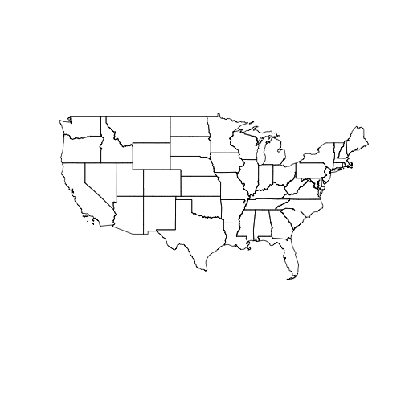

# Visualising the contiguous United States

This package provides three different shapefiles for the United States of America, comprising; state boundaries, congressional districts and counties. These are stored as `sf` objects, if you're not familiar with the excellent `sf` approach to geometric features it's highly recommended you glace at the documentation - https://r-spatial.github.io/sf//index.html

The `sf` objects contain a column called `contiguous.united.states` which allows us to restrict ourselves to only the contiguous US. This is how we might visualise the congressional districts of the contiguous US with leaflet:


```r
library("statesRcontiguous")
library("tidyverse")
#> Loading tidyverse: ggplot2
#> Loading tidyverse: tibble
#> Loading tidyverse: tidyr
#> Loading tidyverse: readr
#> Loading tidyverse: purrr
#> Loading tidyverse: dplyr
#> Conflicts with tidy packages ----------------------------------------------
#> filter(): dplyr, stats
#> lag():    dplyr, stats
library("leaflet")
shp_contiguous_us_congressional_districts <- shp_all_us_congressional_districts %>%
  filter(contiguous.united.states)
shp_contiguous_us_congressional_districts %>%
  leaflet() %>%
  addTiles() %>%
  addPolygons(weight = 1)
#> Warning: sf layer has inconsistent datum (+proj=longlat +datum=NAD83 +no_defs).
#> Need '+proj=longlat +datum=WGS84'
```



# Where are the shapefiles from?

All of the shapefiles in this package are from the US Census website - https://www.census.gov/geo/maps-data/data/tiger-cart-boundary.html. This package will continuously be updated with the most recent shapefiles, historical shapefiles will **not** be available in this package. If that's what you want, please do use the `tigris` package - https://github.com/walkerke/tigris.

The explicit urls for the shapefiles are available here:


```r
knitr::kable(shapefile_details)
```


|description                           | year|url                                                                      |
|:-------------------------------------|----:|:------------------------------------------------------------------------|
|Details about congressional districts | 2016|https://www2.census.gov/geo/tiger/TIGER2016/CD/tl_2016_us_cd115.zip      |
|Details about counties                | 2016|https://www2.census.gov/geo/tiger/TIGER2016/COUNTY/tl_2016_us_county.zip |
|Details about states                  | 2016|https://www2.census.gov/geo/tiger/TIGER2016/STATE/tl_2016_us_state.zip   |
|Shapefile for congressional districts | 2016|http://www2.census.gov/geo/tiger/GENZ2016/shp/cb_2016_us_cd115_20m.zip   |
|Shapefile for counties                | 2016|http://www2.census.gov/geo/tiger/GENZ2016/shp/cb_2016_us_county_20m.zip  |
|Shapefile for states                  | 2016|http://www2.census.gov/geo/tiger/GENZ2016/shp/cb_2016_us_state_20m.zip   |


